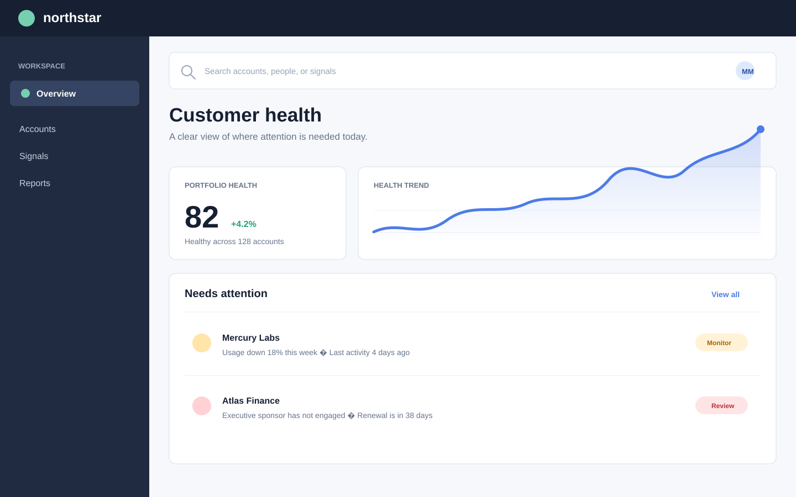
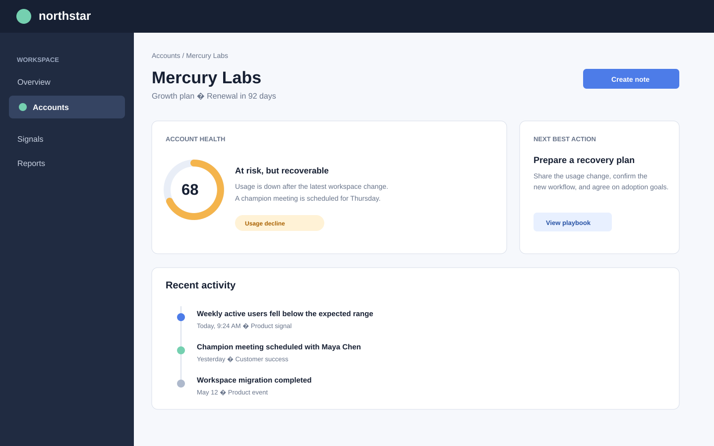

## Outcome

Northstar Console is a fictional customer-health workspace created to demonstrate how a dense operational product can become easier to scan, investigate, and act on.

The redesign puts the important signal first: which accounts need attention, why they need it, and what a team member can do next. It replaces a wall of equally weighted data with a clear hierarchy, focused trends, and an action-oriented activity feed.

## Context

The original experience asked customer-success teams to assemble an account narrative from several disconnected reports. Metrics were technically available, but it took too long to understand whether an account was healthy and which change mattered.

The product needed to support two very different moments:

1. A quick morning scan for accounts that need attention.
2. A deeper investigation before reaching out to a customer.

## Key decisions

### Put the account narrative ahead of the raw metrics

The overview begins with a direct health score, its movement over time, and the factors contributing to that movement. This makes the interface useful before a user has to interpret a chart.

### Give attention a dedicated place

The attention queue is intentionally small and specific. Instead of surfacing every event, it calls out accounts with a clear reason to investigate.

### Make the account page feel like a decision workspace

The account detail pairs a short health explanation with recent activity and suggested next steps. This supports preparation without forcing people through multiple tabs.

## Reflection

The exercise reinforced that data-dense products do not need more visualization to feel useful. They need a stronger hierarchy, a coherent narrative, and a clear distinction between information to monitor and information that requires action.
